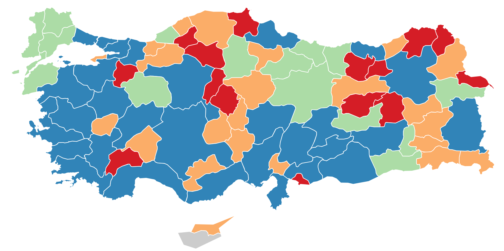

# Turkey GeoJSON Maps

Cities of Turkey, Turkish Republic of Northern Cyprus, Cyprus maps with coordinates and boundaries:

|||
| ------------- |:-------------|
| tr-cities-airports.json | Türkiye + Airports |
| tr-cities-kktc-airports.json | Türkiye + KKTC + Airports |
| tr-cities-cyprus.json | Türkiye + KKTC + GKRY |
| tr-cities-kktc.json | Türkiye + KKTC |
| tr-cities.json | Türkiye |

| Map |
|:-------------------------:|
| |
[JSON](tr-cities-kktc-airports.json)

***
